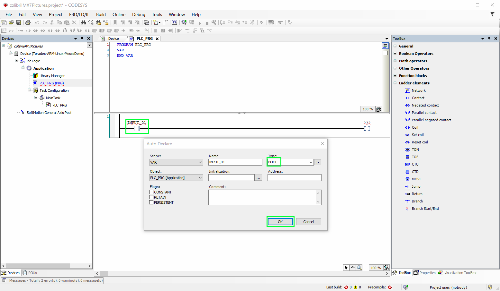
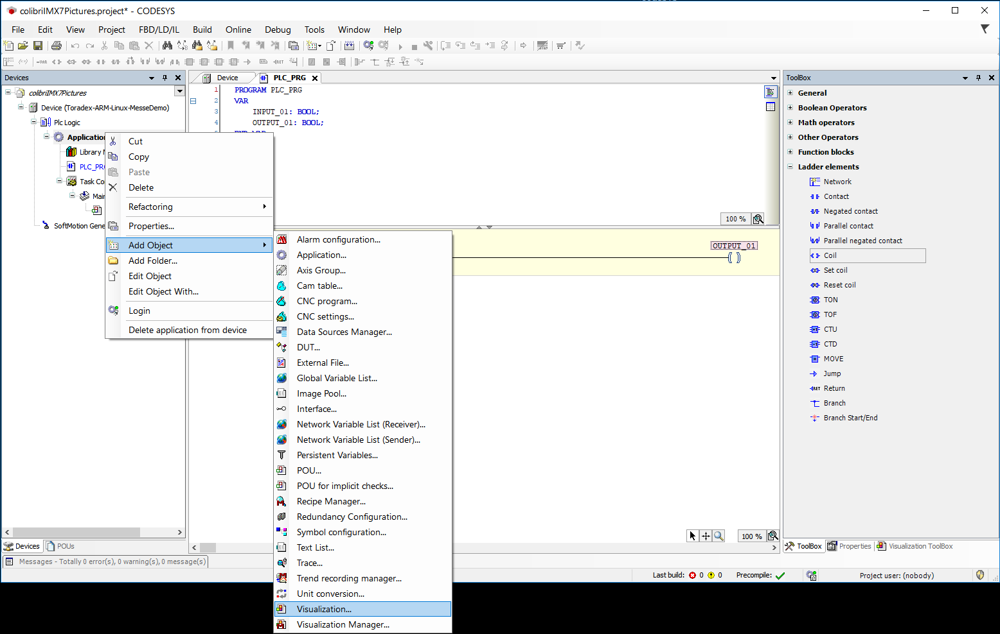
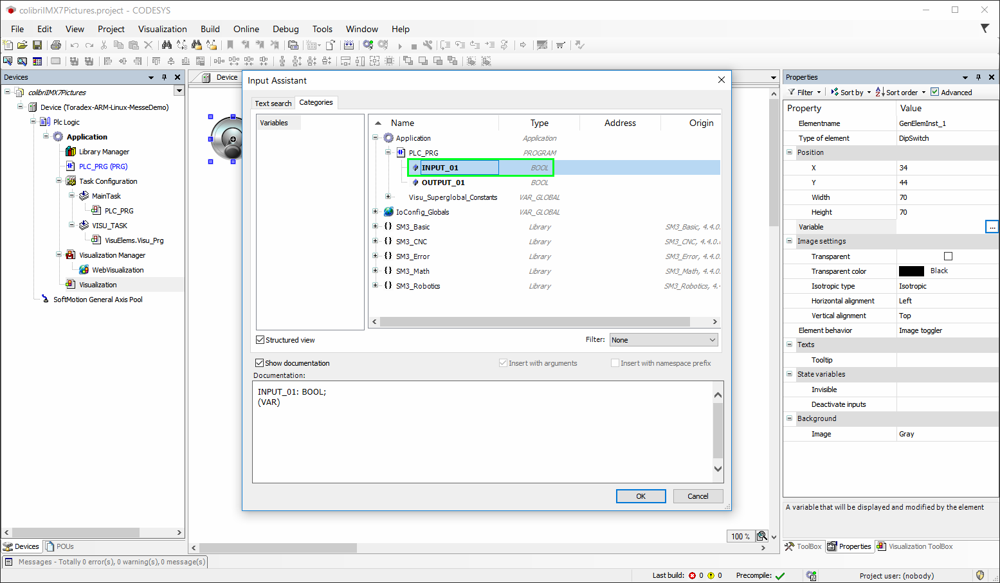
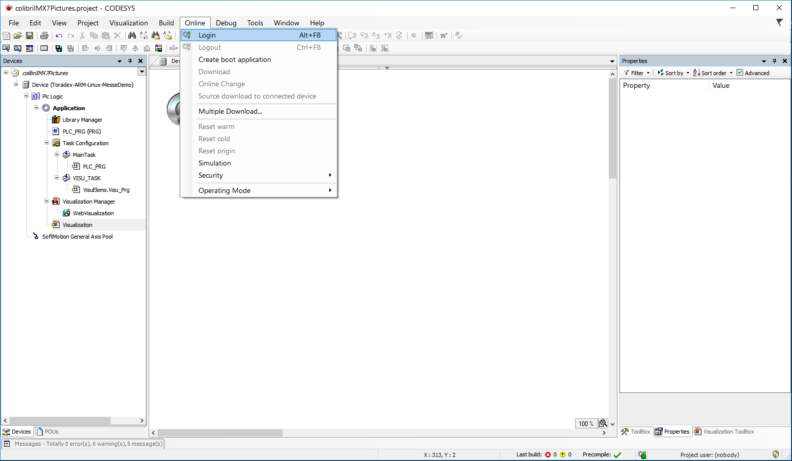
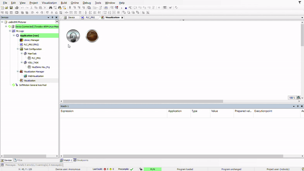
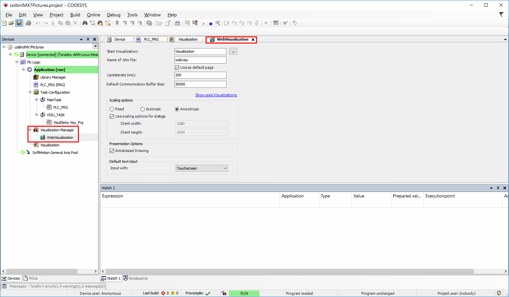
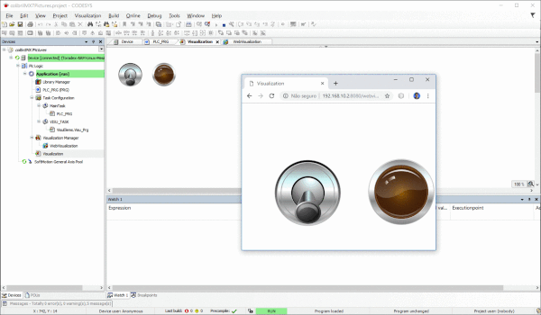
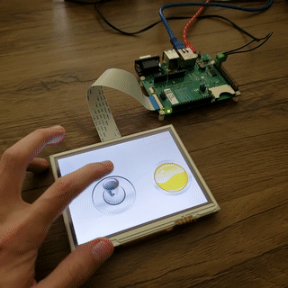

# CODESYS Partner Container

CODESYS is the leading manufacturer-independent IEC 61131-3 automation software
for engineering control systems. As soluções englobam ambiente de
desenvolvimento e runtime.

In this Partner Container we build an image with the Codesys runtime and its
dependences. The container runs using the host network and configures ip
static to *192.168.10.2* for access to runtime target and default gateway to
*192.168.10.1* for development environment.

## How to use the image

### Network Configurations

#### CODESYS Development System

Configure the network of the computer where is the development enviromment
for static ip: *192.168.10.1*

#### Target board

No settings are required on the device network, this will be done by the
own containter when it is initialized. The device's static ip will be set to:
*192.168.10.2*

#### Running on the board

To create a container from the image generated by Dockerfile from this repo
use the following command:

```bash
docker run --name codesys --network host -it --privileged <your/tag:version>
```

#### CODESYS Development System Project

In this repository in the *Development* folder is the file
*CodesysContainerDemo.projectarchive* to import into the development
enviromment system of CODESYS. It was created using the CODESYS Development
System v3.5.14.10.

##### Demo Project - Step By Step

1. Install the device for the CODESYS runtime.

1. Create a new *Standard project*, give the project a name and click ok:


1. Select the device on *Device* was installed on 1. and in *PLC_PRG* select *Ladder*:


1. With the project created double click on *Devive ...*, and with the open tab
click on *Scan network ...*:


1. In the *Select Device* window make sure the device was found and then double
click on it:


1. With the device connected to the development environment we can start the
development. Clicl *PLC_PRG* in the project tree. In *Toolbox* drag and drop a
*Contact* and a *Coil* for the Ladder area:


1. Add the *INPUT_01* variable name in the *Contact* text box and select as
type *BOOL*:


1. Add the *OUTPUT_01* variable name in the *Coil* text box and seelect as type
*BOOL*:


1. Add a *Visualization* to the project. In the project tree right click on
*Application* -> *Add Object* -> *Visualization*:


1. On *Add Visualization* window just click *Add* button:


1. On the *Visualization* tab, which can be opened with double click on
*Visualization* in the project tree, select *Visualization Toolbox* ->
*Lamps/Switches/Bitmaps* one *DipSwitch* and one *Lamp1*, drag and drop one at
a time for the *Visualization* tab:


1. Connect the elements of the visualization with the elements of the ladder.
Select *DipSwitch* and in *Properties* select *Variable*:


1. The *DipSwitch* must be connected to the *Contact* element of the Ladder.
In the window *Input Assist* select *Application* -> *PLC_PRG* -> *INPUT_01*
(the variable which has been added to *Contact*):


1. Select *Lamp1* and in *Properties* select *Variable*. In the window
*Input Assist* select *Application* -> *PLC_PRG* -> *OUTPUT_01* (the variable
which has been added to *Coil*):


1. With the connections made we expect the input *DipSwitch* when triggered 
turn on the output *Lamp1*. To test download the project for the device. Click
the *Online* menu and select *Login* (always choose download):


1. With the project downloaded and online the following screen will be shown
the project will be in the *STOP* state:


1. To start project application on device click on play:

At this point the application will be in the *RUN* state. On the
*Visualization* the elements can already be tested. Pressing the *DipSwitch*
should light the *Lamp1* on.


1. The Visualization feature also adds to the project the *WebVisualization*.
Click on *Visualization Manager* -> *WebVisualization* on project tree. In the
*WebVisualization* tab you can find the settings. This view can be accessed
through the IP of the device, in the case of demo the static IP on port 8080:
*192.168.10.2: 8080*

Triggering the *DipSwitch* will act both the *WebVisualization* of the browser
as in development environment *Visualization*:


##### Demo Project - On Board WebVisualization

This demo also has a container with a minimal Xorg running a browser in
fullscreen mode for *WebVisualization* viewing on a touch screen connected to
the device. To create the container use the command:

```bash
docker run --name webvisu \
	-d -it \
	--privileged \
	-v /var/run/dbus:/var/run/dbus \
	-v /dev:/dev \
	matheuscastello/chrome http://192.168.10.2:8080
```

